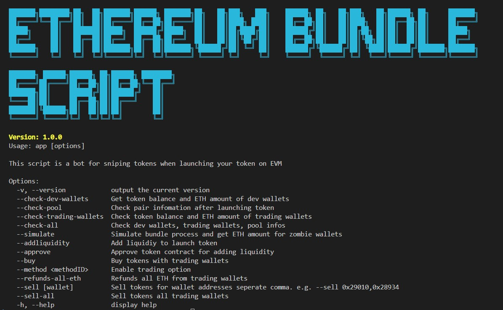

# Ethereum Bundle Script for Ethereum bundle launch

</img>


## 1. To install node modules to run this command.

   ``npm install``

   Please install node > 18.1.0

## 2. Set the environment variables to .env file.

   1. Create a .env file to run this command.

   ``mv env.example .env``

   2. Set the variables in .env file.

      `CHAINID`: chain id to launch your token. 1 or 11155111

      `CHAINNAME`: chain name to launch your token. 'eth' or 'sepolia'

      `CHAIN_RPC_HTTP_URL`: chain rpc http url

      `CHAIN_FLASHBOT_URL`: chain flashbot http url

      `WALLET_DIST_COUNT`: wallet count number to snipe tokens.

      `TOKEN_AMOUNTS_PER_WALLET`: token amounts of each wallet to snipe. This value should be splitted with comma ','.

      `ETH_FOR_LIQUIDITY`: eth amount to add liquidity.

      `TOKEN_FOR_LIQUIDITY`: token amount to add liquidity.

      `TOKEN_ADDRESS`: token address to launch.

      `ZOMBIES`: private keys of 2 zombie wallets. zombie wallet 0: to use token launch such as add liquidity, enable trading, zombie wallet 1: to use disperse ETH into trading wallets used to buy and sell tokens.

## 3. To show description of this script, you can run this command.

   ```node app.js -h```

   ```node app.js --version```

## 4. You should send ETH_FOR_LIQUIDITY eth amount and TOKEN_FOR_LIQUIDITY token amount to first zombie wallet.

## 5. To launch token SENARIO 1.

   ```node app.js --check-dev-wallets```: check your zombie wallets(two wallets) if ETh amount is enough to launch token.

   ```node app.js --addliquidity --approve``` : if not approve token contract for add liquidiy.

   ```node app.js --check-pool``` : check your pair

   ```node app.js --check-trading-wallets``` : check your trading wallets

   ```node app.js --method 0x8a8c523c --buy --simulate``` : simulate enable openTranding and first buy bundling to calculate needed ETH amount for zombie wallets before launch.

   You can see these strings on console

   ┌─────────┬────────────────┬──────────────────────────────────────────────┬─────────┐
   │ (index) │ wallet         │ address                                      │ diffETH │
   ├─────────┼────────────────┼──────────────────────────────────────────────┼─────────┤
   │ 0       │ 'dev wallet 0' │ '0x36E0b2932131b7932FE3a1Cd41c44E11A1a0D032' │ 0.45    │
   │ 1       │ 'dev wallet 1' │ '0x7E1fdE4bF6943b64c3870406e7e6618A09EEbD95' │ 0.23    │
   └─────────┴────────────────┴──────────────────────────────────────────────┴─────────┘

   Please send necessary eth amounts to zombie wallets and then simulate again.
   ┌─────────┬────────────────┬──────────────────────────────────────────────┬─────────┐
   │ (index) │ wallet         │ address                                      │ diffETH │
   ├─────────┼────────────────┼──────────────────────────────────────────────┼─────────┤
   │ 0       │ 'dev wallet 0' │ '0x36E0b2932131b7932FE3a1Cd41c44E11A1a0D032' │ 0       │
   │ 1       │ 'dev wallet 1' │ '0x7E1fdE4bF6943b64c3870406e7e6618A09EEbD95' │ 0       │
   └─────────┴────────────────┴──────────────────────────────────────────────┴─────────┘
   This is success in simulation.

   `If simulate continues to be failed, please contact to @PumpGuru01 through telegram.`

   ```node app.js --method 0xc963af --buy``` : enable openTranding and first buy really.

   ```node app.js --check-trading-wallets``` : check your trading wallets

## 6. To launch token SENARIO 2.

   ```node app.js --check-dev-wallets``` : check your zombie wallets(two wallets) if ETh amount is enough to launch token.

   ```node app.js --addliquidity --buy --simulate``` : simulate add liquidity and first buy bundling to calculate needed ETH amount for zombie wallets before launch.

   You can see these strings on console

   ┌─────────┬────────────────┬──────────────────────────────────────────────┬─────────┐
   │ (index) │ wallet         │ address                                      │ diffETH │
   ├─────────┼────────────────┼──────────────────────────────────────────────┼─────────┤
   │ 0       │ 'dev wallet 0' │ '0x36E0b2932131b7932FE3a1Cd41c44E11A1a0D032' │ 0.45    │
   │ 1       │ 'dev wallet 1' │ '0x7E1fdE4bF6943b64c3870406e7e6618A09EEbD95' │ 0.23    │
   └─────────┴────────────────┴──────────────────────────────────────────────┴─────────┘

   Please send necessary eth amounts to zombie wallets and then simulate again.
   ┌─────────┬────────────────┬──────────────────────────────────────────────┬─────────┐
   │ (index) │ wallet         │ address                                      │ diffETH │
   ├─────────┼────────────────┼──────────────────────────────────────────────┼─────────┤
   │ 0       │ 'dev wallet 0' │ '0x36E0b2932131b7932FE3a1Cd41c44E11A1a0D032' │ 0       │
   │ 1       │ 'dev wallet 1' │ '0x7E1fdE4bF6943b64c3870406e7e6618A09EEbD95' │ 0       │
   └─────────┴────────────────┴──────────────────────────────────────────────┴─────────┘
   This is success in simulation.

### If simulate continues to be failed, please contact to @PumpGuru01 through telegram.

   ```node app.js --addliquidity --buy``` : if your token smart contract doesn't have openTrading() function, use this command.

   ```node app.js --check-trading-wallets```: check your trading wallets

## 7. To sell your token.

   ```node app.js --sell wallet_addr1``` : sell tokens specific one wallet address without bundling.
   ```node app.js --sell wallet_addr1,wallet_addr2,wallet_addr3``` : sell tokens specific wallet address.
   ```node app.js --sell-all``` : sell tokens of all trading wallets
   ```node app.js --check-trading-wallets``` : check your trading wallets

## 8. To buy token.

   ```node app.js --buy```: buy tokens with your trading wallets.

## 9. To refund all ETh to zombie wallet #1

   ```node app.js --refunds-all-eth```: to refund all eth of trading wallets into zombie wallet #1

